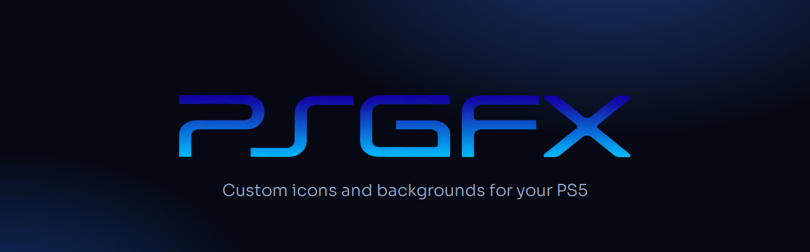
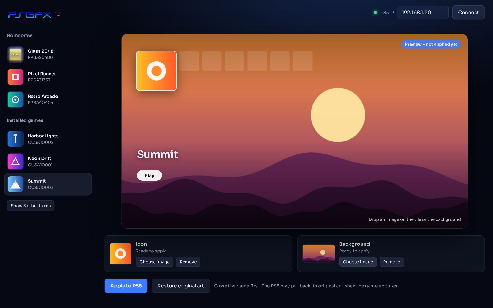
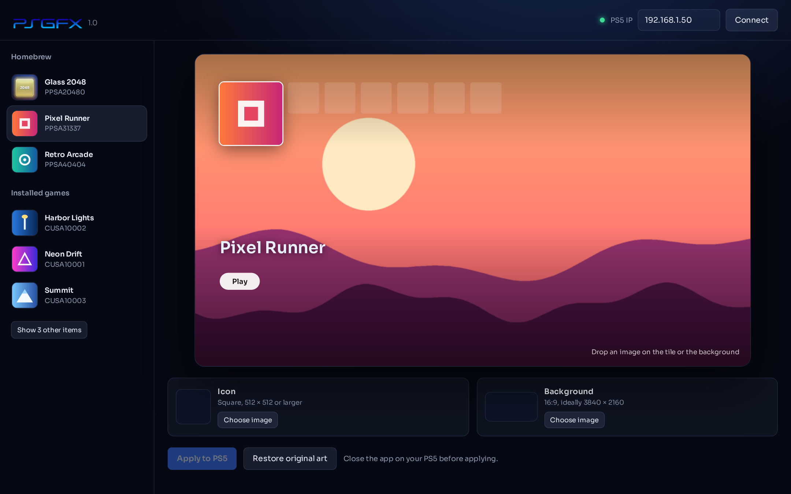
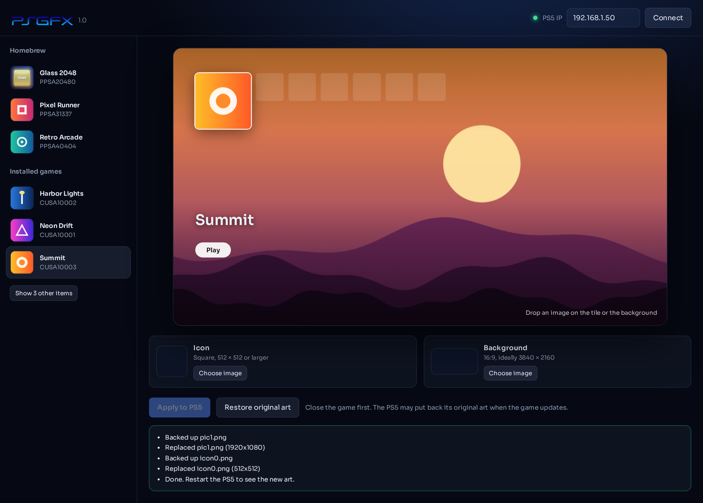

<p align="center">
  
</p>

<p align="center">
  <a href="../../releases/latest"><b>Download PSGFX for Windows</b></a>
</p>

PSGFX gives your PS5 homebrew and games new home-screen art, and lets you arrange the home screen itself: hide tiles like the PlayStation Store, rename anything, move apps between Games and Media, and lock your games in the order you want. Pick an app, drop in any image, and click **Apply**. PSGFX resizes and converts it to the exact format the console expects, uploads it to the right folder, and keeps a backup of the original so you can undo it with one click.

It works through [PS5 Upload](https://github.com/phantomptr/ps5upload)'s payload, which is already running on your console. There's nothing to install on the PS5 or on your PC: PSGFX is a single `.exe`.



## Features

- **Custom icons.** Use any PNG or JPEG. PSGFX crops it to a square and saves it at the console's native size.
- **Custom backgrounds.** Any 16:9 image becomes the backdrop behind the app on the home screen. Homebrew gets full 4K backgrounds.
- **Homebrew and installed games.** Homebrew apps registered with PS5 Upload show up with their icons, and so do your installed PS4 and PS5 games, with their real names.
- **Live preview.** A replica of the PS5 home screen shows your art before anything touches the console. Drop an image on the tile to set the icon, or anywhere else to set the background.
- **One-click restore.** The first time you change something, PSGFX saves the original next to it. **Restore original art** puts it back exactly.
- **Clean list.** System apps and leftovers are tucked away under *Show other items*.
- **Home layout (new in 1.1).** Hide any tile (PlayStation Store, Game Library, PS Plus, media apps), rename games and apps, move apps between the Games and Media tabs, and reorder your games by dragging or with A–Z / Z–A.
- **Lock order.** Keeps your arrangement in place even after you play other games.
- **Layout presets.** Save a layout when you apply it and re-apply it in one click after a firmware update or database rebuild resets the home screen.
- **Home-screen backups.** PSGFX saves the home-screen database before every layout change, plus a copy of the very first one it read. Restore any of them from the Backups dialog.
- **No setup.** A single portable Windows app that opens in your browser. It remembers your PS5's IP address.

## Requirements

- A jailbroken PS5 with **[PS5 Upload](https://github.com/phantomptr/ps5upload)**'s payload running (the same setup you use to upload homebrew).
- A Windows PC on the same network.

## How to use

1. Download `PSGFX.exe` from the [latest release](../../releases/latest) and double-click it. PSGFX opens in your browser.
2. Enter your PS5's IP address (the same one PS5 Upload uses) and click **Connect**.
3. Choose a homebrew app or an installed game from the list.
4. Drop an image onto the preview's tile (**icon**) or background (**background**), or use the **Choose image** buttons.
5. Close that app or game on the PS5, then click **Apply to PS5**.
6. Restart the PS5 to see the new art on the home screen.

To undo, select the app and click **Restore original art**.

### Home layout

1. Connect, then click **Home layout** at the top.
2. Pick a tile in the strip under the preview. Choose **Games**, **Media** or **Hidden**, or type a new name.
3. Drag games into any order, or use **A–Z** / **Z–A**. Tick **Lock order** to keep it that way after you play other games.
4. Click **Apply to PS5**, optionally saving the layout as a preset, then restart the PS5.

PSGFX edits the console's home-screen database (`/system_data/priv/mms/app.db`) through PS5 Upload's built-in FTP server, which it starts for you. Backups and presets are kept in the **PSGFX Layout** folder next to `PSGFX.exe`. If the home screen ever looks wrong, restore a backup, or use Safe Mode → **Rebuild Database**. App Library always comes back on its own; the system adds it regardless of the database.



## Tips

- **Image sizes:** icons look best at 512 × 512 or larger. Backgrounds look best at 3840 × 2160. PSGFX crops and scales anything else automatically.
- **Game updates:** the PS5 may put back a game's original art when that game updates. Apply yours again afterwards.
- **Windows SmartScreen:** the app isn't code-signed, so Windows may warn the first time. Click **More info → Run anyway**. If the firewall asks, allow PSGFX on private networks.
- **Quitting:** close the black console window.



## Build from source

PSGFX is plain C++17 with no external dependencies. Everything it needs is in `src/lib` (including the SQLite amalgamation used for Home layout).

```bash
# Linux / WSL: produces build/PSGFX.exe
sudo apt install g++-mingw-w64-x86-64
./build.sh

# Native Linux binary for development
./build.sh linux
```

On Windows, run `./build.sh` from an [MSYS2](https://www.msys2.org/) MinGW shell. Pushing a tag such as `v1.0.0` builds the exe on GitHub Actions and attaches it to a release.

### How it works

PSGFX runs a small local web server (127.0.0.1 only) and opens your browser to it. It talks to PS5 Upload's payload over its FTX2 protocol on ports 9113 and 9114. It uses the payload's existing commands to list apps, read files, upload them (BLAKE3-verified), copy, and back up. Homebrew art is written to the app's `sce_sys` folder and to the home-screen metadata folder. Game art is written to `/user/appmeta/<title id>` in the same size and format as the original files. Backgrounds are encoded as BC7 DDS where the console uses DDS.

`tools/mock_ps5.py` is a stand-in for the payload that serves a folder on your computer as if it were a PS5. Use it to develop without a console:

```bash
python3 tools/mock_ps5.py ./fake-ps5 39114 39113 &
PS5AS_HOST=127.0.0.1 PS5AS_MGMT_PORT=39114 PS5AS_XFER_PORT=39113 ./build/psgfx
```

## Credits

- [PS5 Upload](https://github.com/phantomptr/ps5upload) by phantomptr, whose payload PSGFX talks to
- [bc7enc](https://github.com/richgel999/bc7enc) by Rich Geldreich, [stb](https://github.com/nothings/stb) by Sean Barrett, [BLAKE3](https://github.com/BLAKE3-team/BLAKE3), [JSON for Modern C++](https://github.com/nlohmann/json) by Niels Lohmann, and the [Sora](https://github.com/sora-xor/sora-font) typeface. See [THIRD_PARTY_NOTICES.md](THIRD_PARTY_NOTICES.md).

## License

[MIT](LICENSE).

PSGFX is an independent fan project. It is not affiliated with, endorsed by, or sponsored by Sony Interactive Entertainment. "PlayStation" and "PS5" are trademarks of Sony Interactive Entertainment Inc. Only use PSGFX with games you own.
